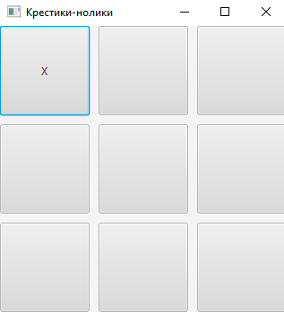
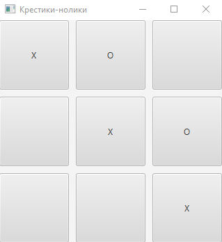

# TicTacToe

### Программа представляет собой реализацию игры "Крестики-нолики" с использованием JavaFX.

1. При запуске приложения создается окно игры с сеткой размером 3x3, состоящей из кнопок. Игроки могут нажимать на кнопки, чтобы сделать свой ход.

   

2. Когда игрок нажимает на кнопку, вызывается метод makeMove, который получает индексы строки и столбца кнопки, по которой был сделан ход, а также саму кнопку.

3. При вызове метода makeMove, программа проверяет, свободно ли поле, на котором был сделан ход. Если поле свободно, программа присваивает текущему игроку значение хода (X или O) и отображает это значение на кнопке.

   

4. Затем программа проверяет, не выполнено ли условие победы (три одинаковых значка в ряд по строкам, столбцам или диагонали). Если условие победы выполнено, вызывается метод showWinMessage, который отображает сообщение о победе и при нажатии кнопки OK сбрасывает игру.

   

   

5. Если все поле заполнено и условие победы не выполнено, программа вызывает метод isBoardFull, который проверяет, заполнено ли поле. Если поле заполнено, вызывается метод showDrawMessage, который отображает сообщение о ничьей и сбрасывает игру.

   

   

6. Если ни одно из условий не выполнено, программа меняет текущего игрока.

7. Метод resetGame сбрасывает игру, устанавливая текущего игрока в значение 'X', очищает поле и кнопки.

### Данная программа разработана таким образом, чтобы была простой в использовании. При ее создании моим главным приоритетом было обеспечение правильной работы всех функций, а не их внешний вид или дизайн. Таким образом, программа простая, но надежная и эффективная в своей задаче.